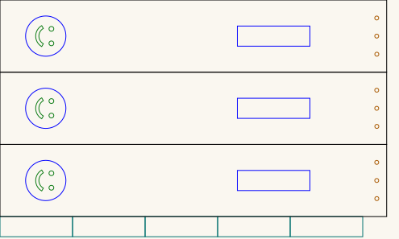
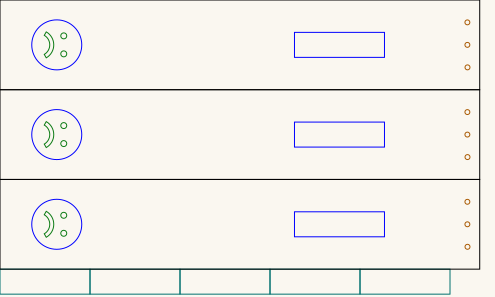

# Slapstick — comedy on one side, tragedy on the other

A slapstick is two long slats joined at one end. Swing it and the free ends clap
together with a crack far louder than the effort suggests. It is the sound effect that
gave stage comedy its name, and it is why a certain kind of comedy is still called
slapstick.

This one carries a face on each side, taken from the **comedy and tragedy masks** of the
theatre: laughing on one, weeping on the other. Which way round it lands when you swing
it is the joke.

Each side is a laminate — **three paddle blanks glued face to face** — and the handle is
built the same way, from the short strips, then glued to the paddle where the engraved
rectangle marks it.

## Get the files

- **[Everything as a ZIP](https://github.com/Gernreich/slapstick/archive/refs/heads/main.zip)**
  — both sheets and the two face discs.
- **[Repository](https://github.com/Gernreich/slapstick)** — if you want to change a face
  or the proportions.
- Or click any picture below to download that one cut file.

Released under CC0 1.0 — do what you like with them, no attribution needed. Built for
**[LaserMadeMusic](https://www.youtube.com/@LaserMadeMusic)**.

## The two sheets

One sheet per side. They are the same in every respect except the mouth. Click either
to download it — these are display renderings, thickened and painted onto a light ground
because the cut files draw a hairline on no background, which a browser shows almost
invisibly. The cut-order colours are untouched.

<table>
<tr>
<td align="center"></td>
</tr>
<tr>
<td align="center">slapstick_happy.svg · comedy · 495 × 297mm sheet</td>
</tr>
<tr>
<td align="center"></td>
</tr>
<tr>
<td align="center">slapstick_sad.svg · tragedy · 495 × 297mm sheet</td>
</tr>
</table>

## Colour is the cut order

**Every colour needs an explicit operation, and the order matters.** Red is not a cut at
all; the rest run first to last:

| | Colour | What it is | When |
|---|---|---|---|
| | **red `#ff0000`** | the face outline and the glue rectangle | **engrave — never cut** |
| 1 | **green `#00ff00`** | eyes and mouth | first cut |
| 2 | **blue `#0000ff`** | the three holes at the far end | second cut |
| 3 | **magenta `#ff00ff`** | the five handle strips | third cut |
| 4 | **black `#000000`** | the three paddle outlines | last cut |

The outlines come last for the usual reason: once a cut frees a part, anything still to
be cut inside it can move. Cut the small features while the blank is still held by the
sheet.

A per-colour job **silently skips any colour you leave unmapped**. Leave black unmapped
and you will engrave two faces and cut no paddles.

## What is on each sheet

Measured out of the files, not copied from whatever drew them. Both sheets are identical
here — 32 objects each, matching object for object:

| Part | Count | Size |
|---|---|---|
| Paddle blank | 3 | 479.7 × 89.7mm |
| Handle strip | 5 | 90 × 25mm |
| Face outline, engraved | 3 | 50mm circle, centred 56.7mm from the left end |
| Glue rectangle, engraved | 3 | 90 × 25mm, starting 294.5mm from the left end |
| Eyes | 6 | 6mm each |
| Mouth | 3 | 9.5 × 26mm |
| Holes | 9 | ~5mm, 12.3mm from the right end, at 22.1 / 44.6 / 66.8mm down |

Both sheets are 495 × 297mm and millimetre-true — `1 user unit = 1 mm` with a physical
`width`/`height` — so they print and cut at real size.

Note the face reads sideways on the sheet, because the paddle is laid out along its
length. It comes upright when the slapstick is held to swing.

## Building it

1. **Glue three paddle blanks face to face**, once per sheet — three for comedy, three
   for tragedy. That laminate is one slat of the slapstick.
2. **Glue the five short strips into one block.** That is the handle.
3. **Glue the handle to the paddle over the engraved rectangle**, which is there to
   show you where. It starts 294.5mm along, so the handle sits toward the far end from
   the face.
4. The three holes at the far end are cut but not used by anything in these files — how
   the two slats join, and what passes through those holes, is yours to decide.

**The engraved rectangle is a mark, not a recess.** Engraving removes very little
material, so the handle glues onto the surface rather than into a pocket.

## Before you cut

**Material and thickness are yours, and nothing here has been validated against cut
stock.** Thickness matters more than usual here: three laminated layers set how stiff
each slat is, and a slapstick's whole job is to be swung hard and stopped abruptly.

**A slapstick is loud on purpose, and it is a lever.** Two slats of nearly half a metre
clapping together will startle anyone nearby. Keep fingers clear of where the slats meet.

## Also here — two face discs

Two earlier 100mm discs, each a face cut clean through, unrelated to the sheets above.
They carry no hinge, no fixing holes and no mechanism; they decorate something you build.

<table>
<tr>
<td align="center"></td>
<td align="center"></td>
</tr>
<tr>
<td align="center">Smiling · 100 × 100mm</td>
<td align="center">Sad · 100 × 100mm</td>
</tr>
</table>

Both are 100 × 100mm, with two 12mm eyes 36mm apart and a 52 × 19mm crescent mouth. The
eyes and mouth are cut through, not engraved — they drop out as waste. The tightest spot
is where the mouth's ends approach the rim, about 14mm of material.

## Files

| | |
|---|---|
| `slapstick_happy.svg` · `slapstick_sad.svg` | one sheet per side — three paddles, five handle strips |
| `SlapstickSmilyFace.svg` · `SlapstickSadFace.svg` | the two 100mm face discs |
| `previews/` | display renderings — **not** cut files |
| `index.md` · `index.html` | this page; the markdown is the source |
